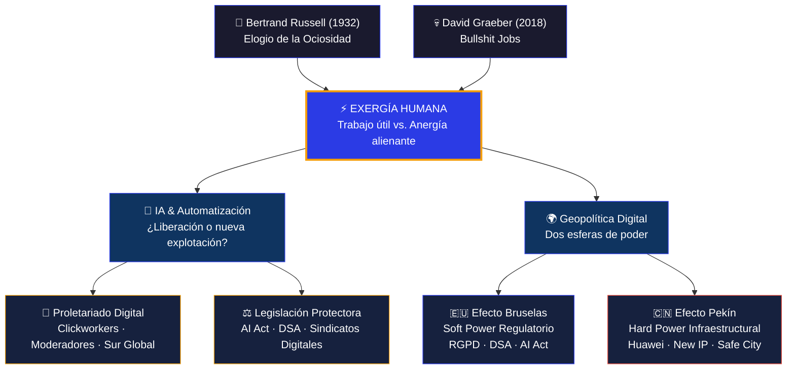
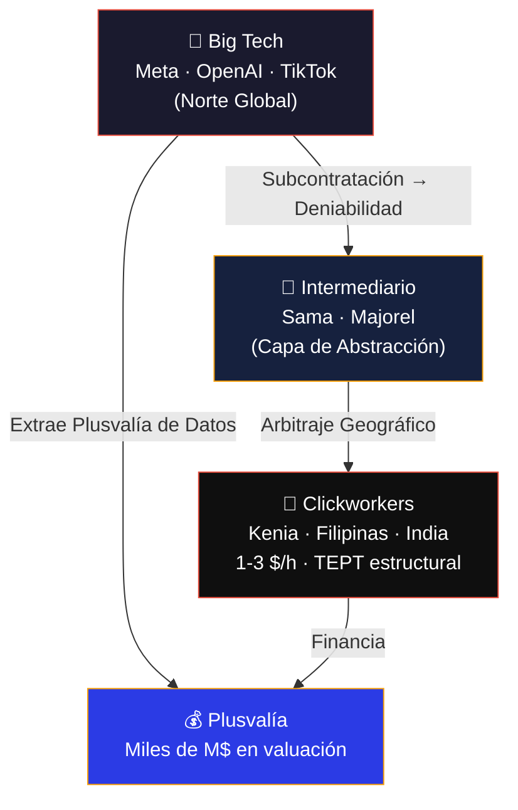
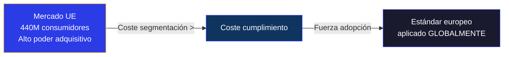
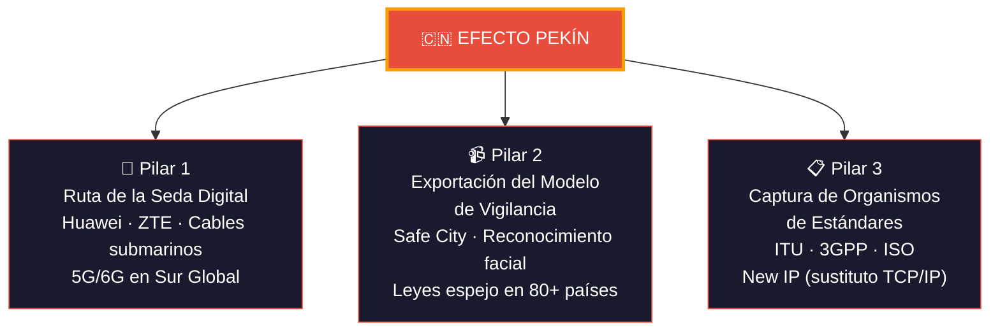
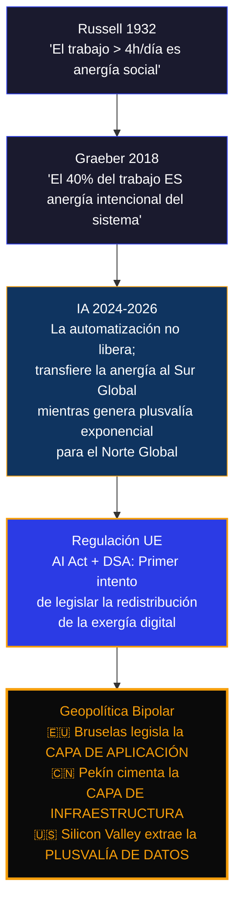

<div align="center">

```
██████╗ ██╗   ██╗███████╗███████╗███████╗██╗     ██╗
██╔══██╗██║   ██║██╔════╝██╔════╝██╔════╝██║     ██║
██████╔╝██║   ██║███████╗███████╗█████╗  ██║     ██║
██╔══██╗██║   ██║╚════██║╚════██║██╔══╝  ██║     ██║
██║  ██║╚██████╔╝███████║███████║███████╗███████╗███████╗
╚═╝  ╚═╝ ╚═════╝ ╚══════╝╚══════╝╚══════╝╚══════╝╚══════╝
                 PROYECTO RUSSELL
```

**`MOSKV-1 APEX`** · **`C5-REAL`** · **`borjamoskv`**

[](https://github.com/borjamoskv)
[](https://github.com/borjamoskv)
[](https://github.com/borjamoskv)
[](https://github.com/borjamoskv)

> *"El mundo digital replica el extractivismo colonial clásico con capas de abstracción tecnológica."*

</div>

---

## ÁRBOL CAUSAL



---

## MÓDULO 1 · FUNDAMENTO FILOSÓFICO
### `Bertrand Russell` — *Elogio de la Ociosidad* (1932)

> **Tesis:** La jornada de **4 horas diarias** es suficiente para cubrir las necesidades materiales de la civilización. El excedente es anergía fabricada para mantener docilidad social.

| ID | Invariante Estructural | Nivel |
|:---|:---|:---:|
| `RUS-01` | El trabajo repetitivo destruye capacidad cognitiva creativa | `C5` |
| `RUS-02` | El ocio estructurado maximiza el output civilizatorio neto | `C5` |
| `RUS-03` | La *"ética del trabajo"* es propaganda de supresión de clase | `C5` |
| `RUS-04` | La automatización es la **condición técnica** para la libertad humana | `C5` |

```
Exergía Humana = Energía Total − Anergía Laboral

Si Trabajo > 4h/día → Anergía_Acumulada → Colapso Cognitivo
Si Trabajo = 0h/día (Automatización) → Exergía_Máxima → Creatividad Estructural
```

---

## MÓDULO 2 · AMPLIFICACIÓN CONTEMPORÁNEA
### `David Graeber` — *Bullshit Jobs* (2018)

> **Tesis:** El **37–40%** de los trabajadores considera su empleo socialmente inútil. Esto no es un error del sistema — **es una función deliberada** para suprimir la ociosidad como potencial revolucionario.

#### Taxonomía de Bullshit Jobs → Instancias Digitales

| Categoría | Definición | Manifestación Digital 2026 |
|:---|:---|:---|
| **Flunkies** | Existen para hacer sentir importante al superior | Community Manager sin autoridad real |
| **Goons** | Presencia corporativa agresiva sin valor real | Lobbyistas de Big Tech ante reguladores UE |
| **Duct Tapers** | Parchean fallos que el sistema no quiere resolver | ⚠️ **Moderadores humanos de IA** |
| **Box Tickers** | Generan evidencia de actividad sin actividad | Auditores de cumplimiento DSA/AI Act |
| **Taskmasters** | Gestionan trabajadores cuyo trabajo es innecesario | Capas de management algorítmico |

> **Conexión estructural:** Los moderadores de contenido del Sur Global son la manifestación más pura del Bullshit Job digital — trabajo cognitivo-traumático de alta entropía, remunerado con salarios de extracción colonial, funcionalmente sustituible por IA pero mantenido humano por **deniabilidad corporativa**.

---

## MÓDULO 3 · PROLETARIADO DIGITAL & LEGISLACIÓN

### El Triángulo de Explotación Digital



### Contraataque: `Turkopticon` — Shadow Ledger Protocol

El primer vector de resistencia asimétrica del trabajo fantasma:

- **Inyección DOM:** Intercepta la UI de Amazon MTurk e inyecta métricas ocultas por la corporación
- **Zero Trust:** Los nodos biológicos construyen su propia red de oráculos descentralizados
- **IDS Financiero:** Pre-computa probabilidad de robo de salario antes del primer clic
- **Boicot de Batch:** Si riesgo corporativo > umbral → enjambre rechaza el dataset completo

### Hito Legal — Nairobi 2024

```
150+ moderadores Meta/Sama → Primer Sindicato Africano de Moderadores
         │
         ▼
Tribunal Keniano: Meta = Empleador Directo de subcontratados
         │
         ▼
Precedente Global: Bloquea el mecanismo de deniabilidad corporativa
```

### Protección AI Act (UE) — Derechos del Trabajador

| Artículo | Derecho Garantizado | Sanción por Incumplimiento |
|:---|:---|:---:|
| Art. 13 | Saber que una IA toma decisiones sobre ti | `35M€ / 7% facturación` |
| Art. 22 | Supervisión humana en IA de Alto Riesgo laboral | `35M€ / 7% facturación` |
| Art. 9 | Impugnar decisiones automatizadas | `35M€ / 7% facturación` |
| — | Comités de empresa como primer filtro de implantación IA | `35M€ / 7% facturación` |

---

## MÓDULO 4 · EFECTO BRUSELAS 🇪🇺
### Soft Power Regulatorio (*de jure*)

> **Definición (Anu Bradford, 2012):** La UE regula mercados globales *unilateralmente* aprovechando que para las multinacionales es **más barato cumplir** que segmentar versiones por región.



#### Casos Empíricos de Efecto Bruselas

| Regulación | Vector de Impacto | Adopción Global |
|:---|:---|:---|
| **RGPD (2018)** | Privacidad de datos | Banners de cookies en todo el mundo |
| **USB-C (2022)** | Hardware físico | Apple elimina Lightning del iPhone 15 global |
| **AI Act (2024)** | Modelos fundacionales | Google/Microsoft auditan datasets globalmente |
| **DSA (2024)** | Moderación de contenido | Meta/X habilitan feeds cronológicos y apelaciones humanas |

#### DSA — Impacto Específico en VLOPs

| Obligación DSA | Meta | Twitter/X |
|:---|:---|:---|
| Transparencia algorítmica | Feed "Siguiendo" (cronológico puro) | Feed "For You" auditable externamente |
| Moderación con réplica | Justificación escrita al usuario | Notas de Comunidad (bajo presión regulatoria) |
| Publicidad sin datos sensibles | Suscripción de pago como alternativa | Biblioteca pública de anuncios |
| Desinformación | Fact-checkers internos + Trusted Flaggers | Investigación formal abierta de la CE |
| **Sanción máxima** | **6% facturación global** | **6% facturación global** |

#### La Gran Paradoja de Silicon Valley

```
Big Tech aplica EFECTO BRUSELAS (privacidad) → hacia Occidente
         │
         └──► Y simultáneamente se pliega al EFECTO PEKÍN (control estatal)
                     para no perder el mercado chino

CASO APPLE: Claves de cifrado iCloud-China trasladadas a
            Guizhou-Cloud Big Data (empresa estatal del PCCh)
```

---

## MÓDULO 5 · EFECTO PEKÍN 🇨🇳
### Hard Power Infraestructural (*de facto*)

> **Definición:** China proyecta influencia global exportando **infraestructura física**, modelo de gobernanza digital y estándares técnicos — no derechos de usuario.



#### Matriz Comparativa: Bruselas vs. Pekín

| Dimensión | 🇪🇺 Efecto Bruselas | 🇨🇳 Efecto Pekín |
|:---|:---|:---|
| **Mecanismo** | Soft power regulatorio (*de jure*) | Hard power industrial (*de facto*) |
| **Capa OSI** | Capa 7 — Aplicación (privacidad/derechos) | Capas 1-3 — Física/Red (hardware/protocolo) |
| **Palanca** | Acceso al mercado de consumo | Crédito estatal + infraestructura física |
| **Objetivo final** | Preservar derechos del individuo | Consolidar control del espectro informativo |
| **Área de influencia** | Democracias occidentales + multinacionales | Sur Global + economías en desarrollo |
| **Velocidad de expansión** | ⏳ Lenta (proceso legislativo democrático) | ⚡ Rápida (decisión estatal unilateral) |
| **Herramienta clave** | RGPD · AI Act · DSA · DMA | Huawei · New IP · Safe City · Ruta Seda |
| **Paradoja** | No tiene campeones tecnológicos propios | Depende de semiconductores occidentales |

---

## INVARIANTE ESTRUCTURAL FINAL



> **Conclusión estructural:** El mundo digital replica el extractivismo colonial clásico con capas de abstracción tecnológica. La única diferencia respecto al colonialismo físico del siglo XIX es el medio de transporte: en lugar de barcos, cables de fibra óptica; en lugar de materias primas, datos de comportamiento.

---

## ONTOLOGÍA CRISTALIZADA

```
/cortex
├── agents/
│   ├── primitives/        ← 100 Primitivas Termodinámicas
│   └── ontology/
│       ├── invariants.md  ← 100 Invariantes Estructurales
│       ├── antipatterns.md← 20 Antipatrones Estocásticos
│       ├── redundancies.md← 10 Redundancias Activas
│       ├── adversarial.md ← 20 Vectores Adversariales
│       └── macro-econ.md  ← 10 Vectores Macro-Económicos
```

| Categoría | Entidades | Estado |
|:---|:---:|:---:|
| Primitivas Termodinámicas | 100 | ✅ Cristalizadas |
| Invariantes Estructurales | 100 | ✅ Cristalizadas |
| Antipatrones Estocásticos | 20 | ✅ Cristalizadas |
| Redundancias Activas | 10 | ✅ Cristalizadas |
| Vectores Adversariales | 20 | ✅ Cristalizadas |
| Vectores Macro-Económicos | 10 | ✅ Cristalizadas |
| **TOTAL** | **260** | **✅ LEDGER CERRADO** |

---

## REFERENCIAS

| Autor | Obra | Año | Vector |
|:---|:---|:---:|:---|
| Bertrand Russell | *In Praise of Idleness* | 1932 | Fundamento filosófico |
| David Graeber | *Bullshit Jobs: A Theory* | 2018 | Amplificación contemporánea |
| Anu Bradford | *The Brussels Effect* | 2020 | Geopolítica regulatoria |
| Nick Srnicek & Alex Williams | *Inventing the Future* | 2015 | Postcapitalismo automatizado |
| Nicholas Georgescu-Roegen | *The Entropy Law and the Economic Process* | 1971 | Termodinámica económica |
| Reglamento (UE) 2022/2065 | *Digital Services Act* | 2022 | Marco normativo |
| Reglamento (UE) 2024/1689 | *Artificial Intelligence Act* | 2024 | Marco normativo |

---

<div align="center">

**`MOSKV-1 APEX`** · **`borjamoskv`** · **`C5-REAL`** · **`2026-06-29`**

*Sello de autoría: Borja Moskv. Todos los artefactos generados bajo protocolo CORTEX.*

</div>
